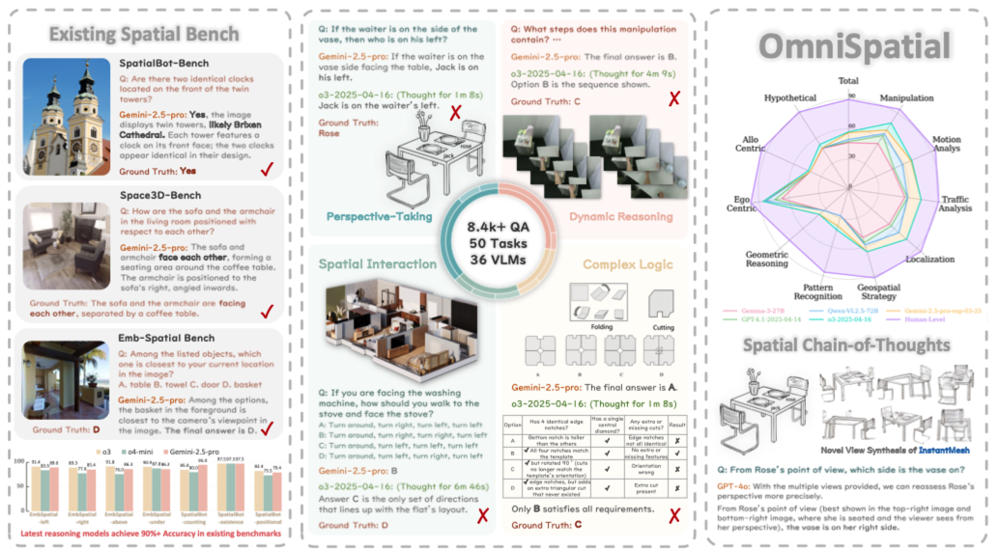

# Awesome 3D Topo Benchmark (Related Papers)

This repo curates papers, datasets, and benchmarks for evaluating **3D / topological structure reasoning** in **vision-language(-action) models and embodied agents**.  
We focus on topology-flavored capabilities such as continuity, separation, order, enclosure, holes, and knot/entanglement reasoning.
Contributions are very welcome — please feel free to open an issue or submit a PR.

## Table of Contents

- [Foundations / Methods](#foundations--methods)
  - [Cognitive and Developmental Foundations](#cognitive-and-developmental-foundations)
  - [Topological Task Analysis](#topological-task-analysis)
  - [Mathematical Formalization](#mathematical-formalization)
- [Benchmarks / Datasets by Ability](#benchmarks--datasets-by-ability)
  - [Cross-Ability / Spatial Taxonomy](#cross-ability--spatial-taxonomy)
  - [Continuity](#continuity)
  - [Separation](#separation)
  - [Order](#order)
  - [Enclosure](#enclosure)
  - [Holes](#holes)
  - [Knot / Entanglement](#knot--entanglement)
- [Model Diagnostics](#model-diagnostics)
- [Tools / Environments](#tools--environments)
- [Others](#others)

---

## Foundations / Methods

Papers that justify the taxonomy or define the topological concepts used by the benchmark.

### Cognitive and Developmental Foundations

| Title | Introduction | Date | Code |
|---|---|---:|:---:|
| Piaget & Inhelder, [*The Child's Conception of Space*](https://api.pageplace.de/preview/DT0400.9781136220722_A23815605/preview-9781136220722_A23815605.pdf) | Foundational cognitive-development account of topological, projective, and Euclidean spatial concepts, including proximity, separation, order, enclosure, and surrounding. | 1948, 1956 | — |
| Beth & Piaget, [*Mathematical Epistemology and Psychology*](https://books.google.com/books/about/Mathematical_Epistemology_and_Psychology.html?id=3C540QEACAAJ) | Epistemological account of mathematical structures and the psychology of logico-mathematical thought. | 1966 | — |
| Papert, [*Mindstorms: Children, Computers, and Powerful Ideas*](https://www.media.mit.edu/publications/mindstorms/) | Constructionist account of children building mathematical ideas through computational objects-to-think-with. | 1980 | — |

### Topological Task Analysis

| Title | Introduction | Date | Code |
|---|---|---:|:---:|
| Martin, [An Analysis of Some of Piaget's Topological Tasks from a Mathematical Point of View](https://www.jstor.org/stable/748762) | Compares Piaget's spatial-concept tasks with mathematical/topological concepts and highlights terminology mismatches. | 1976 | — |
| Strohecker, [*Why Knot?*](https://www.carolstrohecker.info/PapersByYear/1991/WhyKnotDiss.pdf) | Doctoral dissertation on learning topology through knot-tying and media-rich construction environments. | 1991 | — |
| [Understanding Topological Relationships through Comparisons of Similar Knots](http://www.carolstrohecker.info/PapersByYear/1996/UnderstandTopological.pdf) | Learning topology via comparing similar knots, with emphasis on neighborhood, continuity, and boundary. | 1996 | — |
| Gärdenfors, P. *Conceptual Spaces: The Geometry of Thought* (MIT Press), Ch. 3 “Topological and Geometric Properties” | Defines connectedness for regions; argues natural properties are connected; introduces convexity criterion for concepts. | 2000 | — |

### Mathematical Formalization

| Title | Introduction | Date | Code |
|---|---|---:|:---:|
| Hatcher, [*Algebraic Topology*](https://pi.math.cornell.edu/~hatcher/AT/AT.pdf) | Standard algebraic topology reference for homology, holes, enclosure by spheres, and formal separation results such as the Jordan Curve Theorem. | 2002 | — |

---

## Benchmarks / Datasets by Ability

Papers, datasets, and environments that can directly inspire benchmark items or baselines.

| Ability | Static Perception | Temporal Consistency | Intervention / Planning |
|---|---|---|---|
| Continuity | Maze reachability, Möbius continuity, connected components | Object/path continuity across views or frames | Pipe connection, route planning |
| Separation | Shape/object separation, disjoint components | Maintaining separated objects under motion | One-stroke color grouping, partition actions |
| Order | Origami state order, beam-string spatial order, stacking order | Recovering action/order sequence from video | Hanoi Tower, reordering tasks |
| Enclosure | Inside/outside, closed boundary, hole detection, nested containers | Containment persistence under viewpoint or object motion | Laser game, containment manipulation |
| Holes | Hole/tunnel/cavity detection, genus or Euler-characteristic checks, CAD hole features | Hole preservation under view, deformation, reconstruction, or generation | Peg-in-hole insertion, topology-preserving CAD/mesh editing |
| Knot | Closed loop vs. open rope, knot/link detection, chain count | Knot state consistency across deformation | Rope untangling, link manipulation |

### Cross-Ability / Spatial Taxonomy

| Title | Introduction | Date | Code |
|---|---|---:|:---:|
| [SPATIAL-DISE: A Unified Benchmark for Evaluating Spatial Reasoning in Vision-Language Models](https://arxiv.org/pdf/2510.13394) |  | 2025-10 | [Dataset](https://huggingface.co/datasets/TACPS-liv/Spatial-DISE) |
| [Mind the Gap: Benchmarking Spatial Reasoning in Vision-Language Models](https://arxiv.org/abs/2503.19707) |  | 2025-03 | [Github](https://github.com/stogiannidis/srbench) |
| [Open3D-VQA: A Benchmark for Comprehensive Spatial Reasoning with Multimodal Large Language Model in Open Space](https://arxiv.org/abs/2503.11094) |  | 2025-03 | [Github](https://github.com/EmbodiedCity/Open3D-VQA.code) |
| [ScanQA: 3D Question Answering for Spatial Scene Understanding](https://arxiv.org/abs/2112.10482) |  | 2021-12 | [Github](https://github.com/ATR-DBI/ScanQA) |

### Continuity

| Title | Introduction | Date | Code |
|---|---|---:|:---:|
| [TDBench: Benchmarking Vision-Language Models in Understanding Top-Down Images](https://arxiv.org/abs/2504.03748) |  | 2025-04 | — |
| [AlphaMaze: Enhancing Large Language Models' Spatial Intelligence via GRPO](https://arxiv.org/abs/2502.14669) |  | 2025-02 | — |
| [Thinking in Space: How Multimodal Large Language Models See, Remember, and Recall Spaces](https://arxiv.org/abs/2412.14171) |  | 2024-12 | [Github](https://github.com/vision-x-nyu/thinking-in-space) |
| [AMaze: An intuitive benchmark generator for fast prototyping of generalizable agents](https://arxiv.org/abs/2411.13072) |  | 2024-11 | — |
| [Topological Planning with Transformers for Vision-and-Language Navigation (CVPR 2021)](https://arxiv.org/abs/2012.05292) |  | 2021 | — |

### Separation

| Title | Introduction | Date | Code |
|---|---|---:|:---:|
| [OmniSpatial: Towards Comprehensive Spatial Reasoning Benchmark for Vision Language Models (ICLR 2026)](https://openreview.net/forum?id=6nZKT2rL0H) |  <!-- Large-scale VLM benchmark with dynamic reasoning, complex spatial logic, spatial interaction, and perspective-taking tasks; useful for separation-style relational prompts beyond simple left/right. --> | 2026-01 | [Github](https://github.com/qizekun/omnispatial) |
| [SITE: towards Spatial Intelligence Thorough Evaluation (ICCV 2025)](https://openaccess.thecvf.com/content/ICCV2025/html/Wang_SITE_towards_Spatial_Intelligence_Thorough_Evaluation_ICCV_2025_paper.html) | Multi-choice VQA benchmark for spatial intelligence across single-image, multi-image, and video modalities; useful for static/dynamic separation and viewpoint-sensitive spatial relation evaluation. | 2025-10 | — |
| [3DSRBench: A Comprehensive 3D Spatial Reasoning Benchmark (ICCV 2025)](https://3dsrbench.github.io/) | 3D spatial reasoning benchmark with manually annotated VQA over natural and synthetic multi-view images; probes location, orientation, height, and multi-object spatial relations under common/uncommon viewpoints. | 2025-10 | [Project](https://3dsrbench.github.io/) |
| [Enhancing Spatial Reasoning in Multimodal Large Language Models through Reasoning-based Segmentation (ICCV 2025)](https://openaccess.thecvf.com/content/ICCV2025/html/Ning_Enhancing_Spatial_Reasoning_in_Multimodal_Large_Language_Models_through_Reasoning-based_ICCV_2025_paper.html) | Introduces 3D ReasonSeg for point-cloud reasoning segmentation; relevant to separating target objects from distractors through relational 3D instructions. | 2025-10 | — |
| [Can Multimodal Large Language Models Understand Spatial Relations? (ACL 2025)](https://aclanthology.org/2025.acl-long.31/) | SpatialMQA is a human-annotated COCO-based benchmark for objective-world spatial relation reasoning, reducing language-prior shortcuts in MLLM evaluation. | 2025-07 | [Dataset](https://huggingface.co/datasets/liuziyan/SpatialMQA) |
| [RoboSpatial: Teaching Spatial Understanding to 2D and 3D Vision-Language Models for Robotics](https://openreview.net/forum?id=Sextl6R3Nf) | Large-scale robotics-oriented 2D/3D spatial dataset with 1M images, 5K 3D scans, and 3M annotated spatial relationships for relation prediction and manipulation. | 2025-02 | — |
| [Visual Spatial Reasoning](https://aclanthology.org/2023.tacl-1.37/) | Natural image-text benchmark with topological spatial relations such as contains, within, inside, outside, detached from, touching, and enclosed by. | 2023 | [Dataset](https://huggingface.co/datasets/cambridgeltl/vsr_random) |
| [Rel3D: A Minimally Contrastive Benchmark for Grounding Spatial Relations in 3D (NeurIPS 2020)](https://proceedings.neurips.cc/paper/2020/file/76dc611d6ebaafc66cc0879c71b5db5c-Paper.pdf) | Human-annotated 3D spatial-relation benchmark with minimally contrastive scene pairs, including relations such as in, covering, around, and other separation/enclosure predicates. | 2020 | [Github](https://github.com/princeton-vl/Rel3D) |

### Order

| Title | Introduction | Date | Code |
|---|---|---:|:---:|
| TBD | TBD | — | — |

### Enclosure

| Title | Introduction | Date | Code |
|---|---|---:|:---:|
| [OmniSpatial: Towards Comprehensive Spatial Reasoning Benchmark for Vision Language Models (ICLR 2026)](https://openreview.net/forum?id=6nZKT2rL0H) |  <!-- Includes complex spatial logic, interaction, and perspective-taking tasks that can seed containment and inside/outside-style benchmark variants. --> | 2026-01 | [Github](https://github.com/qizekun/omnispatial) |
| [Can Multimodal Large Language Models Understand Spatial Relations? (ACL 2025)](https://aclanthology.org/2025.acl-long.31/) | SpatialMQA evaluates objective-world spatial relations in real images, making it a strong source for inside/outside and containment phrasing without pure language shortcuts. | 2025-07 | [Dataset](https://huggingface.co/datasets/liuziyan/SpatialMQA) |
| [Zero-Shot Peg Insertion: Identifying Mating Holes and Estimating SE(2) Poses with Vision-Language Models](https://arxiv.org/abs/2503.06026) | VLM-driven robotic assembly pipeline that detects candidate holes, selects the correct mating hole, estimates pose, and executes insertion on unseen peg-hole pairs. | 2025-03 | — |
| [Visual Spatial Reasoning](https://aclanthology.org/2023.tacl-1.37/) | Natural image-text benchmark with explicit topological relations, including contains, within, inside, outside, surrounding, and enclosed by. | 2023 | [Dataset](https://huggingface.co/datasets/cambridgeltl/vsr_random) |
| [Rel3D: A Minimally Contrastive Benchmark for Grounding Spatial Relations in 3D (NeurIPS 2020)](https://proceedings.neurips.cc/paper/2020/file/76dc611d6ebaafc66cc0879c71b5db5c-Paper.pdf) | 3D spatial-relation benchmark with minimally contrastive positives/negatives; directly motivates enclosure contrasts such as object-in-container vs. object-outside-container. | 2020 | [Github](https://github.com/princeton-vl/Rel3D) |

### Holes

| Title | Introduction | Date | Code |
|---|---|---:|:---:|
| [Thinking in Structures: Evaluating Spatial Intelligence through Reasoning on Constrained Manifolds](https://arxiv.org/abs/2602.07864) | SSI-Bench evaluates VLM reasoning on real 3D structures governed by geometric, topological, and physical constraints; useful for hole/tunnel-like constrained-manifold reasoning. | 2026-02 | [Project](https://ssi-bench.github.io/) |
| [EvoCAD: Evolutionary CAD Code Generation with Vision Language Models](https://arxiv.org/abs/2510.11631) | Uses Euler-characteristic-based topology error/correctness metrics for CAD generation, giving a direct evaluation handle for whether generated 3D objects preserve hole structure. | 2025-10 | — |
| [VideoCAD: A Large-Scale Video Dataset for Learning UI Interactions and 3D Reasoning from CAD Software](https://arxiv.org/abs/2505.24838) | CAD interaction/video dataset with a derived CAD-VQA benchmark that includes explicit binary hole-detection questions over CAD images. | 2025-05 | [Github](https://github.com/BrandonMan123/VideoCAD) |
| [Computer Vision Models Show Human-Like Sensitivity to Geometric and Topological Concepts](https://arxiv.org/abs/2505.13281) | Odd-one-out diagnostic for 43 geometric/topological concepts across CNNs, ViTs, and VLMs; useful for visual hole/topology concept sensitivity tests. | 2025-05 | — |
| [Zero-Shot Peg Insertion: Identifying Mating Holes and Estimating SE(2) Poses with Vision-Language Models](https://arxiv.org/abs/2503.06026) | VLM-based intervention task where the model must identify compatible mating holes and reason about insertion pose for unseen peg-hole geometry. | 2025-03 | — |
| [Euler Characteristic Transform Based Topological Loss for Reconstructing 3D Images From Single 2D Slices (CVPRW 2023)](https://openaccess.thecvf.com/CVPR2023_workshops/TAG-PRA) | Uses Euler Characteristic Transform as a topology-preserving loss for 3D reconstruction, explicitly targeting global structure such as connectivity, tunnels, and voids. | 2023-06 | — |
| [BRepNet: A Topological Message Passing System for Solid Models (CVPR 2021)](https://openaccess.thecvf.com/content/CVPR2021/html/Lambourne_BRepNet_A_Topological_Message_Passing_System_for_Solid_Models_CVPR_2021_paper.html) | Operates directly on CAD boundary representations and the Fusion 360 Gallery segmentation dataset, preserving face/edge/coedge topology for solid models with loops and holes. | 2021 | [Github](https://github.com/AutodeskAILab/BRepNet) |

### Knot / Entanglement

| Title | Introduction | Date | Code |
|---|---|---:|:---:|
| [Knot So Simple: A Minimalistic Environment for Spatial Reasoning](https://arxiv.org/abs/2505.18028) |  | 2025-05 | [Github](https://github.com/lil-lab/knotgym) |
| [Untangling Dense Non-Planar Knots by Learning Manipulation Features and Recovery Policies](https://arxiv.org/abs/2107.08942) |  | 2021-07 | [Website](https://sites.google.com/berkeley.edu/non-planar-untangling) |
| [Untangling Dense Knots by Learning Task-Relevant Keypoints](https://arxiv.org/abs/2011.04999) |  | 2020-11 | — |
| [Learning to Manipulate Deformable Objects without Demonstrations](https://arxiv.org/abs/1910.13439) |  | 2019-10 | — |
| [10K Knots (Kaggle)](https://www.kaggle.com/datasets/josephcameron/10knots) |  | 2018 | — |

---

## Model Diagnostics

Papers that reveal strengths or failures of MLLMs, VLMs, VLA systems, and video generative models on topological structure.

| Title | Introduction | Date | Code |
|---|---|---:|:---:|
| [VisRes Bench: On Evaluating the Visual Reasoning Capabilities of VLMs](https://arxiv.org/html/2512.21194v1) |  | 2025-12 | — |
| [Generalizing Shape-from-Template to Topological Changes (STAG 2025)](https://arxiv.org/abs/2511.03459) |  | 2025-11 | — |
| [OPTiCAL: An Abstract Positional Reasoning Benchmark for Vision Language Models](https://ufdatastudio.com/papers/driggers-ellis2025optical.pdf) |  | 2025 | [Github](https://github.com/ufdatastudio/optical?tab=readme-ov-file) |
| [Computer Vision Models Show Human-Like Sensitivity to Geometric and Topological Concepts](https://arxiv.org/abs/2505.13281) |  | 2025-05 | — |
| [Revisiting 3D LLM Benchmarks: Are We Really Testing 3D Capabilities? (ACL Findings 2025)](https://arxiv.org/abs/2502.08503) |  | 2025-02 | — |

---

## Tools / Environments

Implementation references used to build, render, or operationalize benchmark tasks.

| Title | Introduction | Date | Code |
|---|---|---:|:---:|
| [Handle-based Mesh Deformation Guided By Vision Language Model](https://arxiv.org/abs/2506.04562) |  | 2025-06 | — |
| [three.js](https://threejs.org) |  | — | [Github](https://github.com/mrdoob/three.js/) |
| [Physically Grounded Vision-Language Models for Robotic Manipulation](https://ieeexplore.ieee.org/document/10610090) |  | — | — |

---

## Others

Relevant papers that provide adjacent motivation but do not directly define the taxonomy, produce benchmark tasks, diagnose models, or support implementation.

| Title | Introduction | Date | Code |
|---|---|---:|:---:|
| TBD | TBD | — | — |
