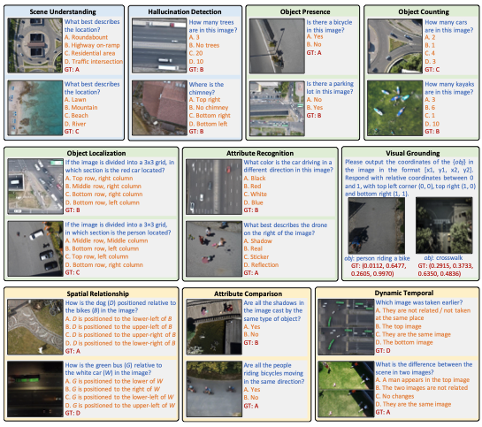
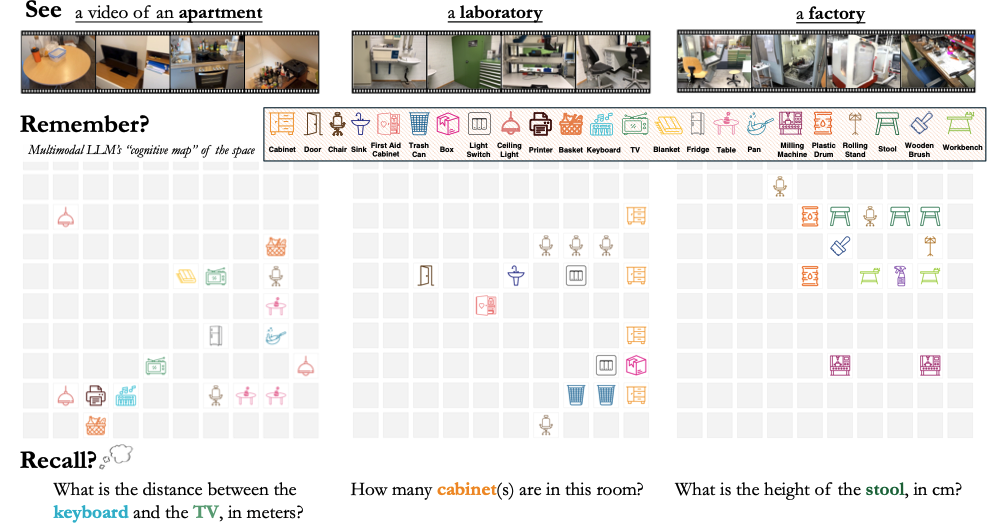
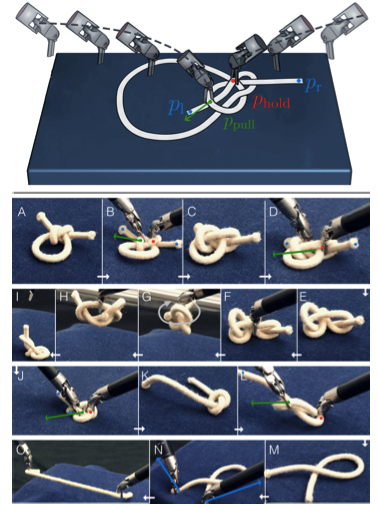
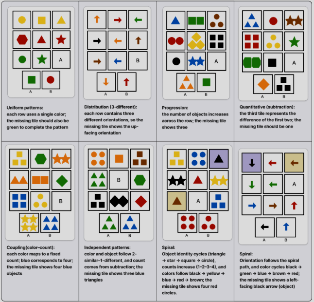
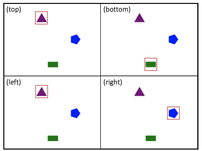
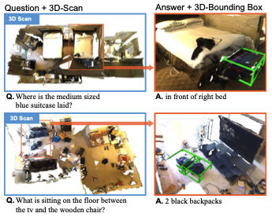
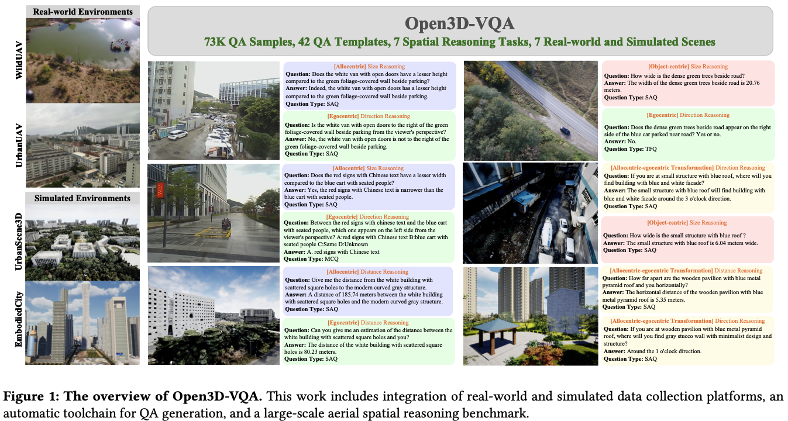
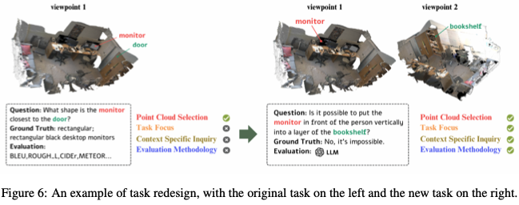

# Awesome 3D Topo Benchmark (Related Papers)

This repo curates papers, datasets, and benchmarks for evaluating **3D / topological structure reasoning** in **vision-language(-action) models and embodied agents**.  
We focus on topology-flavored capabilities such as connectivity, enclosure/separation, holes, and entanglement.  
Contributions are very welcome — please feel free to open an issue or submit a PR.

## Table of Contents
- [Methods](#methods)
- [Datasets & Benchmarks](#datasets--benchmarks)
  - [Topological / Spatial Taxonomy Benchmarks for VLMs](#topological--spatial-taxonomy-benchmarks-for-vlms)
  - [Connectivity](#connectivity)
  - [Enclosure & Separation](#enclosure--separation)
  - [Holes](#holes)
  - [Entanglement](#entanglement)
  - [Geometric & Topological Concept Diagnostics](#geometric--topological-concept-diagnostics)
- [Findings & Applications](#findings--applications)
- [Appendix](#appendix)
  - [Text-only / Symbolic Baselines (LLM)](#text-only--symbolic-baselines-llm)
  - [Tools](#tools)

---

## Methods

| Title | Introduction | Date | Code |
|---|---|---:|:---:|
| [The Child's Conception of Space](https://api.pageplace.de/preview/DT0400.9781136220722_A23815605/preview-9781136220722_A23815605.pdf) | Foundational cognitive-development account of topological, projective, and Euclidean spatial concepts. | 1948 | — |

---

## Datasets & Benchmarks

All tables are sorted by **time (newest first)**.

### Topological / Spatial Taxonomy Benchmarks for VLMs

| Title | Introduction | Date | Code |
|---|---|---:|:---:|
| [SPATIAL-DISE: A Unified Benchmark for Evaluating Spatial Reasoning in Vision-Language Models](https://arxiv.org/pdf/2510.13394) |  | 2025-10 | [Dataset](https://huggingface.co/datasets/TACPS-liv/Spatial-DISE) |
| [Mind the Gap: Benchmarking Spatial Reasoning in Vision-Language Models](https://arxiv.org/abs/2503.19707) |  | 2025-03 | [Github](https://github.com/stogiannidis/srbench) |

### Connectivity

| Title | Introduction | Date | Code |
|---|---|---:|:---:|
| [TDBench: Benchmarking Vision-Language Models in Understanding Top-Down Images](https://arxiv.org/abs/2504.03748) |  | 2025-04 | — |
| [Thinking in Space: How Multimodal Large Language Models See, Remember, and Recall Spaces](https://arxiv.org/abs/2412.14171) |  | 2024-12 | [Github](https://github.com/vision-x-nyu/thinking-in-space) |
| [AMaze: An intuitive benchmark generator for fast prototyping of generalizable agents](https://arxiv.org/abs/2411.13072) |  | 2024-11 | — |
| [Topological Planning with Transformers for Vision-and-Language Navigation (CVPR 2021)](https://arxiv.org/abs/2012.05292) |  | 2021 | — |

### Enclosure & Separation

| Title | Introduction | Date | Code |
|---|---|---:|:---:|

| TBD | TBD | — | — |

### Holes

| Title | Introduction | Date | Code |
|---|---|---:|:---:|
| TBD | TBD | — | — |

### Entanglement

| Title | Introduction | Date | Code |
|---|---|---:|:---:|
| [Knot So Simple: A Minimalistic Environment for Spatial Reasoning](https://arxiv.org/abs/2505.18028) |  | 2025-05 | [Github](https://github.com/lil-lab/knotgym) |
| [Untangling Dense Non-Planar Knots by Learning Manipulation Features and Recovery Policies](https://arxiv.org/abs/2107.08942) |  | 2021-07 | [Website](https://sites.google.com/berkeley.edu/non-planar-untangling) |
| [Untangling Dense Knots by Learning Task-Relevant Keypoints](https://arxiv.org/abs/2011.04999) |  | 2020-11 | — |
| [Learning to Manipulate Deformable Objects without Demonstrations](https://arxiv.org/abs/1910.13439) |  | 2019-10 | — |
| [10K Knots (Kaggle)](https://www.kaggle.com/datasets/josephcameron/10knots) |  | 2018 | — |

### Geometric & Topological Concept Diagnostics

| Title | Introduction | Date | Code |
|---|---|---:|:---:|
| [VisRes Bench: On Evaluating the Visual Reasoning Capabilities of VLMs](https://arxiv.org/html/2512.21194v1) |  | 2025-12 | — |
| [Generalizing Shape-from-Template to Topological Changes (STAG 2025)](https://arxiv.org/abs/2511.03459) |  | 2025-11 | — |
| [OPTiCAL: An Abstract Positional Reasoning Benchmark for Vision Language Models](https://ufdatastudio.com/papers/driggers-ellis2025optical.pdf) |  | 2025 | [Github](https://github.com/ufdatastudio/optical?tab=readme-ov-file) |
| [Computer Vision Models Show Human-Like Sensitivity to Geometric and Topological Concepts](https://arxiv.org/abs/2505.13281) |  | 2025-05 | — |
| [ScanQA: 3D Question Answering for Spatial Scene Understanding](https://arxiv.org/abs/2112.10482) |  | 2021-12 | [Github](https://github.com/ATR-DBI/ScanQA) |

---

## Findings & Applications

TBD.

---

## Appendix

### Text-only / Symbolic Baselines (LLM)

Used to isolate reasoning/planning from visual perception.

| Title | Introduction | Date | Code |
|---|---|---:|:---:|
| [Open3D-VQA: A Benchmark for Comprehensive Spatial Reasoning with Multimodal Large Language Model in Open Space](https://arxiv.org/abs/2503.11094) |  | 2025-03 | [Github](https://github.com/EmbodiedCity/Open3D-VQA.code) |
| [AlphaMaze: Enhancing Large Language Models' Spatial Intelligence via GRPO](https://arxiv.org/abs/2502.14669) |  | 2025-02 | — |
| [Revisiting 3D LLM Benchmarks: Are We Really Testing 3D Capabilities? (ACL Findings 2025)](https://arxiv.org/abs/2502.08503) |  | 2025-02 | — |

### Tools

| Title | Introduction | Date | Code |
|---|---|---:|:---:|
| [Handle-based Mesh Deformation Guided By Vision Language Model](https://arxiv.org/abs/2506.04562) |  | 2025-06 | — |
| [three.js](https://threejs.org) |  | — | [Github](https://github.com/mrdoob/three.js/) |
| [Physically Grounded Vision-Language Models for Robotic Manipulation](https://ieeexplore.ieee.org/document/10610090) |  | — | — |